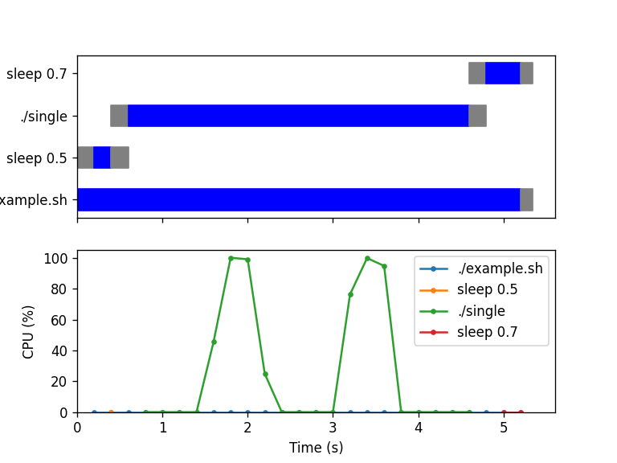

<!--
Copyright 2020-2022 Laurent Cabaret
Copyright 2020-2022 Vincent Jacques
-->

*Chrones* is a software development tool to visualize runtime statistics (CPU percentage, GPU percentage, memory usage, *etc.*) about your program and correlate them with the phases of your program.

It aims at being very simple to use and provide useful information out-of-the box *and* at being customizable to your specific use cases.

Here is an example of graph produced by *Chrones* about a shell script launching a few executables (see [at the end of this Readme](#code-of-the-example-image) exactly how this image is generated):

*Chrones* was sponsored by [Laurent Cabaret](https://cabaretl.pages.centralesupelec.fr/en/publications/) from the [MICS](http://www.mics.centralesupelec.fr/) and written by [Vincent Jacques](https://vincent-jacques.net).

It's licensed under the [MIT license](http://choosealicense.com/licenses/mit/).
Its [documentation and source code](https://github.com/jacquev6/Chrones) are on GitHub.

Questions? Remarks? Bugs? Want to contribute? Open [an issue](https://github.com/jacquev6/Chrones/issues) or [a discussion](https://github.com/jacquev6/Chrones/discussions)!

<!-- @todo Insert paragraph about Chrones' clients? -->

# Conceptual overview

*Chrones* consist of three parts: instrumentation (optional), monitoring and reporting.

The instrumentation part of *Chrones* runs inside your program after you've modified it.
It's used as a library for your programming language.
To use it, you add one-liners to the functions you want to know about.
After that, your program logs insider timing information about these functions.

The monitoring part is a wrapper around your program.
It runs your program as you instruct it to, preserving its access to the standard input and outputs, the environment, and its command-line.
While doing so, it monitors your program's whole process tree and logs resource usage metrics.

The reporting part of *Chrones* reads the logs produced by the instrumentation and monitoring, and produces human-readable reports including graphs.

The instrumentation part of *Chrones* is completely optional.
You can use the monitoring part on non-instrumented programs,
or even on partially instrumented programs like a shell script calling an instrumented executable and a non-instrumented executable.
The graphs produced by *Chrones*' reporting will just miss information about your program's phases.

We've chosen the command-line as the main user interface for *Chrones*' to allow easy integration into your automated workflows.
It can also be used as a Python library for advanced use-cases.

Please note that *Chrones* currently only works on Linux.
Furthermore, the C++ instrumentation requires g++.
We would gladly accept contributions that extend *Chrones*' usability.

*Chrones*' instrumentation libraries are available for Python, C++ and the shell language.

# Expected performance

The instrumentation part of *Chrones* accurately measures and reports durations down to the millisecond.
Its monitoring part takes samples a few times per second.
No nanoseconds in this project; *Chrones* is well suited for programs that run for longer than a dozen seconds.

Overhead introduced by *Chrones* in C++ programs is less than a second per million instrumented blocks.
Don't use it for functions called billions of times.

# Get started

## Install *Chrones*

The monitoring and reporting parts of *Chrones* are distributed as a [Python package on PyPI](https://pypi.org/project/Chrones/).
Install them with `pip install Chrones`.

And at the moment that's all you need.

The instrumentation parts are distributed in language-specific ways.

The Python version comes with the `Chrones` Python packages you've just installed.

The C++ and shell languages don't really have package managers, so the C++ and shell versions happen to also be distributed within the Python package.

Versions for other languages will be distributed using the appropriate packages managers.

## (Optional) Instrument your code

### Concepts

The instrumentation libraries are based on the following concepts:

#### Coordinator

The *coordinator* is a single object that centralizes measurements and writes them into a log file.

It also takes care of enabling or disabling instrumentation: the log will be created if and only if it detects it's being run inside *Chrones*' monitoring.
This lets you run your programm outside *Chrones*' monitoring as if it was not instrumented.

#### Chrone

A *chrone* is the main instrumentation tool.
You can think of it as a stopwatch that logs an event when it's started and another event when it's stoped.

Multiple chrones can be nested.
This makes them particularly suitable to instrument [structured code](https://en.wikipedia.org/wiki/Structured_programming) with blocks and functions (*i.e.* the vast majority of modern programs).
From the log of the nested chrones, *Chrones*' reporting is able to reconstruct the evolution of the call stack(s) of the program.

@todo Talk about name, label, and index

#### Mini-chrone

@todo Define, explain the added value

### Language-specific instructions

The *Chrones* instrumentation library is currently available for the following languages:

#### Shell

First, import *Chrones* and initialize the coordinator with:

    source <(chrones shell activate program-name)

where `program-name` is... the name of your program.

You can then use the two functions `chrones_start` and `chrones_stop` to instrument your shell functions:

    function foo {
        chrones_start foo

        # Do something

        chrones_stop
    }

@todo Name, label, and index

#### C++

First, `#include <chrones.hpp>`.
The header is distributed within *Chrones*' Python package.
You can get is location with `chrones config c++ header-location`, that you can pass to the `-I` option of you compiler.
For example, `g++ foo.cpp -I$(chrones config c++ header-location) -o foo`.

Create the coordinator at global scope, before your `main` function:

    CHRONABLE("program-name")

    int main() {
        // Do something
    }

where `program-name` is... the name of your program.

Then you can instrument functions and blocks using the `CHRONE` macro:

    void foo() {
        CHRONE();

        // Do something
    }

    void bar() {
        // Do something

        {
            CHRONE("block label");
        }
    }

*Chrones*' instrumentation can be statically disabled by passing `-DCHRONES_DISABLED` to the compiler.
In that case, all macros provided by the header will be empty and your code will compile exactly as if it was not using *Chrones*.

@todo Name, label, and index

#### Python

First, import *Chrones*' decorator: `from chrones.instumentation import chrone`.

Then, decorate your functions:

    @chrone
    def foo():
        # Do something

You can also instrument blocks that are not functions:

    with chrone("bar"):
        # Do something

@todo Name, label, and index

## Run using `chrones run`

Compile your executable(s) if required.
Then launch them using `chrones run -- your_program --with --its --options`.

Everything before the `--` is interpreted as options for `chrones run`.
Everything after is passed as-is to your program.
The standard input and output are passed unchanged to your program.

Have a look at `chrones run --help` for its detailed usage.

## Generate report

Run `chrones report` to generate a report in the current directory.

Have a look at `chrones report --help` for its detailed usage.

## Use *Chrones* as a library

Out of the box, *Chrones* produces generic reports and graphs, but you can customize them by using *Chrones* as a Python library.

@todo Describe

# Code of the example image

As a complete example, here is the shell script that the image at the top of this Readme is about:

<!-- START example.sh -->
    # File name: example.sh

    source <(chrones shell activate example)

    chrones_start sleep-then-run-single
    sleep 0.5

    dd status=none if=/dev/random of=in.dat bs=1M count=3

    chrones_start run-single
    ./single
    chrones_stop

    chrones_stop

    chrones_start sleep
    sleep 0.7
    chrones_stop
<!-- STOP -->

And the various executables called by the script:

<!-- START single.cpp -->
    // File name: single.cpp

    #include <chrono>
    #include <fstream>
    #include <thread>

    #include <chrones.hpp>

    using namespace std::chrono_literals;

    CHRONABLE("single");

    void do_some_ios() {
      CHRONE();

      char megabyte[1024 * 1024];

      std::ifstream in("in.dat");

      for (int i = 0; i != 4; ++i) {
        in.read(megabyte, sizeof(megabyte));
        std::this_thread::sleep_for(500ms);
        std::ofstream out("out.dat");
        out.write(megabyte, sizeof(megabyte));
        std::this_thread::sleep_for(500ms);
      }
    }

    void something_long() {
      CHRONE();

      for (int i = 0; i < 256; ++i) {
        volatile double x = 3.14;
        for (int j = 0; j != 1'000'000; ++j) {
          x = x * j;
        }
      }
    }

    void something_else() {
      CHRONE();

      std::this_thread::sleep_for(500ms);
    }

    int main() {
      CHRONE();

      do_some_ios();

      {
        // @todo CHRONE("loop");
        for (int i = 0; i != 2; ++i) {
          // @todo CHRONE("iteration", i);

          something_else();
          something_long();
        }
      }

      something_else();
    }
<!-- STOP -->

This code is built using these commands:

<!-- START build.sh -->
    g++ -std=c++2a -O3 -I$(chrones config c++ header-location) single.cpp -o single
<!-- STOP -->

It's executed like this:

<!-- START run.sh -->
    chrones run -- ./example.sh
<!-- STOP -->

And the report is created like this:

<!-- START report.sh -->
    chrones report
<!-- STOP -->

# Known limitations

## Impacts of instrumentation

Adding instrumentation to your program will change what's observed by the monitoring:

- data is continuously output to the log file and this is visible in the "I/O" graph of the report
- the log file is also counted in the "Open files" graph
- in C++, an additional thread is launched in your process, visible in the "Threads" graph

## Non-monotonous system clock

*Chrones* does not handle Leap seconds well. But who does, really?

## Multiple GPUs

Machines with more than one GPU are not supported
<!-- @todo Support machines with several GPUs? -->

# Developing *Chrones* itself

Dependencies:
- a reasonably recent version of Docker
- a reasonably recent version of Python 3
- a reasonably recent version of Bash

To build everything and run all tests:

    ./run-development-cycle.py --long

To skip particularly long tests:

    ./run-development-cycle.py

Or even:

    ./run-development-cycle.py --quick

To [bump the version number](semver.org) and publish on PyPI:

    ./publish.sh [patch|minor|major]
