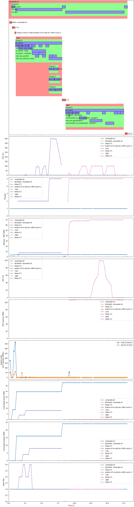

<!--
Copyright 2020-2022 Laurent Cabaret
Copyright 2020-2022 Vincent Jacques
-->

*Chrones* is a software development tool to visualize runtime statistics (CPU percentage, GPU percentage, memory usage, *etc.*) about your program and correlate them with the phases of your program.

It aims at being very simple to use and provide useful information out of the box<!-- @todo(later) *and* at being customizable to your specific use cases -->.

Here is an example of graph produced by *Chrones* about a shell script launching a few executables (see exactly how this image is generated [at the end of this Readme](#code-of-the-example-image)):

*Chrones* was sponsored by [Laurent Cabaret](https://cabaretl.pages.centralesupelec.fr/) from the [MICS](http://www.mics.centralesupelec.fr/) and written by [Vincent Jacques](https://vincent-jacques.net).

It's licensed under the [MIT license](http://choosealicense.com/licenses/mit/).
Its [documentation and source code](https://github.com/jacquev6/Chrones) are on GitHub.

Questions? Remarks? Bugs? Want to contribute? Open [an issue](https://github.com/jacquev6/Chrones/issues) or [a discussion](https://github.com/jacquev6/Chrones/discussions)!

<!-- @todo(later) Insert paragraph about Chrones' clients? -->

# Conceptual overview

*Chrones* consist of three parts: instrumentation (optional), monitoring and reporting.

The instrumentation part of *Chrones* runs inside your program after you've modified it.
It's used as a library for your programming language.
To use it, you add one-liners to the functions you want to know about.
After that, your program logs insider timing information about these functions.

The monitoring part is a wrapper around your program.
It runs your program as you instruct it to, preserving its access to the standard input and outputs, the environment, and its command-line.
While doing so, it monitors your program's whole process tree and logs resource usage metrics.

The reporting part reads the logs produced by the instrumentation and monitoring, and produces human-readable reports including graphs.

The instrumentation part is completely optional.
You can use the monitoring part on non-instrumented programs,
or even on partially instrumented programs like a shell script calling two executables, one instrumented and one not.
The graphs produced by *Chrones*' reporting will just miss information about your program's phases.

We've chosen the command-line as the main user interface for *Chrones*' to allow easy integration into your automated workflows.
<!-- @todo(later) It can also be used as a Python library for advanced use-cases. -->

Please note that *Chrones* currently only works on Linux.
Furthermore, the C++ instrumentation requires g++.
We would gladly accept contributions that extend *Chrones*' usability.

*Chrones*' instrumentation libraries are available for <!-- @todo(later) Python,--> C++ and the shell language.

# Expected performance

The instrumentation part of *Chrones* accurately measures and reports durations down to the millisecond.
Its monitoring part takes samples a few times per second.
No nanoseconds in this project; *Chrones* is well suited for programs that run at least a few seconds.

Overhead introduced by *Chrones* in C++ programs is less than a second per million instrumented blocks.
Don't use it for functions called billions of times.

# Get started

## Install *Chrones*

The monitoring and reporting parts of *Chrones* are distributed as a [Python package on PyPI](https://pypi.org/project/Chrones/).
Install them with `pip install Chrones`.

And at the moment that's all you need. <small>(Click the arrow for more information)</small>

The instrumentation parts are distributed in language-specific ways.

<!-- @todo The Python version comes with the `Chrones` Python packages you've just installed. -->

The C++ and shell languages don't really have package managers, so the C++ and shell versions happen to also be distributed within the Python package.

Versions for other languages will be distributed using the appropriate packages managers.

## (Optional) Instrument your code

### Concepts

The instrumentation libraries are based on the following concepts:

#### Coordinator

The *coordinator* is a single object that centralizes measurements and writes them into a log file.

It also takes care of enabling or disabling instrumentation: the log will be created if and only if it detects it's being run inside *Chrones*' monitoring.
This lets you run your program outside *Chrones*' monitoring as if it was not instrumented.

#### Chrone

A *chrone* is the main instrumentation tool.
You can think of it as a stopwatch that logs an event when it's started and another event when it's stopped.

Multiple chrones can be nested.
This makes them particularly suitable to instrument [structured code](https://en.wikipedia.org/wiki/Structured_programming) with blocks and functions (*i.e.* the vast majority of modern programs).
From the log of the nested chrones, *Chrones*' reporting is able to reconstruct the evolution of the call stack(s) of the program.

Chrones have three identifying attributes: a *name*, an optional *label* and an optional *index*.
The three of them are used in reports to distinguish between chrones.
Here is their meaning:

- In languages that support it, the name is set automatically from the name of the enclosing function.
In languages that don't, we strongly recommend that you use the same convention: a chrone's name comes from the closest named piece of code.
- It sometimes makes sense to instrument a block inside a function.
The label is here to identify those blocks.
- Finally, when these blocks are iterations of a loop, you can use the index to distinguish them.

See `simple.cpp` at the end of this Readme for a complete example.

<!-- @todo(later) Later because they don't appear on report.png, only in summaries. #### Mini-chrone -->

### Language-specific instructions

The *Chrones* instrumentation library is currently available for the following languages:

#### Shell

First, import *Chrones* and initialize the coordinator with:

    source <(chrones instrument shell enable program-name)

where `program-name` is... the name of your program.

You can then use the two functions `chrones_start` and `chrones_stop` to instrument your shell functions:

    function foo {
        chrones_start foo

        # Do something

        chrones_stop
    }

`chrones_start` accepts one mandatory argument: the `name`, and two optional ones: the `label` and `index`.
See their description in the [Concepts](#concepts) section above.

#### C++

First, `#include <chrones.hpp>`.
The header is distributed within *Chrones*' Python package.
You can get is location with `chrones instrument c++ header-location`, that you can pass to the `-I` option of you compiler.
For example, ``g++ -I`chrones instrument c++ header-location` foo.cpp -o foo``.

`chrones.hpp` uses variadic macros with `__VA_OPT__`, so if you need to set your `-std` option, you can use either `gnu++11` or `c++20` or later.

Create the coordinator at global scope, before your `main` function:

    CHRONABLE("program-name")

where `program-name` is... the name of your program.

You can then instrument functions and blocks using the `CHRONE` macro:

    int main() {
        CHRONE();

        {
            CHRONE("loop");
            for (int i = 0; i != 100; ++i) {
                CHRONE("iteration", i);
                // Do something
            }
        }
    }

The `CHRONE` macro accepts zero to two arguments: the optional label and index. See their description in the [Concepts](#concepts) section above.
In the example above, all three chrones will have the same name, `"int main()"`.
`"loop"` and `"iteration"` will be the respective labels of the last two chrones, and the last chrone will also have an index.

*Chrones*' instrumentation can be statically disabled by passing `-DCHRONES_DISABLED` to the compiler.
In that case, all macros provided by the header will be empty and your code will compile exactly as if it was not using *Chrones*.

Troubleshooting tip: if you get an `undefined reference to chrones::global_coordinator` error, double-check you're linking with the translation unit that calls `CHRONABLE`.

Known limitations:

- `CHRONE` must not be used outside `main`, *e.g.* in constructors and destructors of static variables

<!-- @todo(later) #### Python

First, import *Chrones*' decorator: `from chrones.instumentation import chrone`.

Then, decorate your functions:

    @chrone
    def foo():
        # Do something

You can also instrument blocks that are not functions:

    with chrone("bar"):
        # Do something

@todo(later) Name, label, and index -->

## Run using `chrones run`

Compile your executable(s) if required.
Then launch them using `chrones run -- your_program --with --its --options`,
or `chrones run --monitor-gpu -- your_program` if your code uses an NVidia GPU.

Everything before the `--` is interpreted as options for `chrones run`.
Everything after is passed as-is to your program.
The standard input and output are passed unchanged to your program.
The exit code of `chrones run` is the exit code of `your_program`.

Have a look at `chrones run --help` for its detailed usage.

## Generate report

Run `chrones report` to generate a report in the current directory.

Have a look at `chrones report --help` for its detailed usage.

<!-- @todo(later) ## Use *Chrones* as a library

Out of the box, *Chrones* produces generic reports and graphs, but you can customize them by using *Chrones* as a Python library. -->

# Code of the example image

As a complete example, here is the shell script that the image at the top of this Readme is about (named `example.sh`):

<!-- START example.sh --><!--
    #!/bin/bash

    set -o errexit
    trap 'echo "Error on ${BASH_SOURCE[0]}:$LINENO"' ERR
--><!-- STOP -->
<!-- EXTEND example.sh -->
    source <(chrones instrument shell enable example)

    function waste_time {
      chrones_start waste_time
      sleep 0.5
      chrones_stop
    }

    waste_time

    dd status=none if=/dev/random of=in.dat bs=16M count=1

    chrones_start run-cpu
    ./cpu
    chrones_stop

    waste_time

    chrones_start run-gpu
    ./gpu
    chrones_stop

    waste_time
<!-- STOP -->
<!-- CHMOD+X example.sh -->

And the two executables called by the script:

- `cpu.cpp`:

<!-- START cpu.cpp -->
    #include <time.h>

    #include <chrones.hpp>

    CHRONABLE("cpu");

    void waste_time() {
      CHRONE();

      usleep(500'000);
    }

    void input_and_output() {
      CHRONE();

      char data[4 * 1024 * 1024];

      std::ifstream in("in.dat");

      for (int i = 0; i != 2; ++i) {
        in.read(data, sizeof(data));
        waste_time();
        std::ofstream out("out.dat");
        out.write(data, sizeof(data));
        waste_time();
      }
    }

    void use_cpu(const int repetitions) {
      CHRONE();

      for (int i = 0; i < repetitions; ++i) {
        volatile double x = 3.14;
        for (int j = 0; j != 1'000'000; ++j) {
          x = x * j;
        }
      }
    }

    void use_several_cores() {
      CHRONE();

      #pragma omp parallel for
      for (int i = 0; i != 8; ++i) {
        use_cpu(256 + i * 32);
      }
    }

    int main() {
      CHRONE();

      waste_time();

      input_and_output();

      {
        CHRONE("loop");
        for (int i = 0; i != 2; ++i) {
          CHRONE("iteration", i);

          waste_time();
          use_cpu(256);
        }
      }

      waste_time();

      use_several_cores();
    }
<!-- STOP -->

- `gpu.cu`:

<!-- START gpu.cu -->
    #include <cassert>

    #include <chrones.hpp>

    const int block_size = 1024;
    const int blocks_count = 128;
    const int data_size = blocks_count * block_size;

    CHRONABLE("gpu");

    void waste_time() {
      CHRONE();

      usleep(500'000);
    }

    void transfer_to_device(double* h, double* d) {
      CHRONE();

      for (int i = 0; i != 8'000'000; ++i) {
        cudaMemcpy(h, d, data_size * sizeof(double), cudaMemcpyHostToDevice);
      }
      cudaDeviceSynchronize();
    }

    __global__ void use_gpu_(double* data) {
      const int i = blockIdx.x * block_size + threadIdx.x;
      assert(i < data_size);

      volatile double x = 3.14;
      for (int j = 0; j != 700'000; ++j) {
        x = x * j;
      }
      data[i] *= x;
    }

    void use_gpu(double* data) {
      CHRONE();

      use_gpu_<<<blocks_count, block_size>>>(data);
      cudaDeviceSynchronize();
    }

    void transfer_to_host(double* d, double* h) {
      CHRONE();

      for (int i = 0; i != 8'000'000; ++i) {
        cudaMemcpy(d, h, data_size * sizeof(double), cudaMemcpyDeviceToHost);
      }
      cudaDeviceSynchronize();
    }

    int main() {
      CHRONE();

      waste_time();

      {
        CHRONE("Init CUDA");
        cudaFree(0);
      }

      waste_time();

      double* h = (double*)malloc(data_size * sizeof(double));
      for (int i = 0; i != data_size; ++i) {
        h[i] = i;
      }

      waste_time();

      double* d;
      cudaMalloc(&d, data_size * sizeof(double));

      waste_time();

      transfer_to_device(h, d);

      waste_time();

      use_gpu(d);

      waste_time();

      transfer_to_host(d, h);

      waste_time();

      cudaFree(d);

      waste_time();

      free(h);

      waste_time();
    }
<!-- STOP -->

<!-- @todo(later) Understand why transfers don't show in the report -->

This code is built using `make` and the following `Makefile`:

<!-- START run.sh --><!--
    #!/bin/bash

    set -o errexit
    trap 'echo "Error on ${BASH_SOURCE[0]}:$LINENO"' ERR

    if [[ -z "$CHRONES_DEV_USE_GPU" ]]
    then
      exit
    fi

    rm -f run-results.json example.*.chrones.csv cpu.*.chrones.csv gpu.*.chrones.csv report.png in.dat out.dat

    make
--><!-- STOP -->
<!-- CHMOD+X run.sh -->

<!-- START Makefile -->
    all: cpu gpu

    cpu: cpu.cpp
    	g++ -fopenmp -O3 -I`chrones instrument c++ header-location` cpu.cpp -o cpu

    gpu: gpu.cu
    	nvcc -O3 -I`chrones instrument c++ header-location` gpu.cu -o gpu
<!-- STOP -->
<!-- EXTEND Makefile --><!--

    cpu: Makefile
    gpu: Makefile
--><!-- STOP -->

It's executed like this:

<!-- EXTEND run.sh -->
    OMP_NUM_THREADS=4 chrones run --monitor-gpu -- ./example.sh
<!-- STOP -->

And the report is created like this:

<!-- EXTEND run.sh -->
    chrones report
<!-- STOP -->

# Known limitations

## Impacts of instrumentation

Adding instrumentation to your program will change what's observed by the monitoring:

- data is continuously output to the log file and this is visible in the "I/O" graph of the report
- the log file is also counted in the "Open files" graph
- in C++, an additional thread is launched in your process, visible in the "Threads" graph

## Non-monotonous system clock

*Chrones* does not handle Leap seconds well. But who does, really?

## Multiple GPUs

Machines with more than one GPU are not yet supported.
<!-- @todo(later) Support machines with several GPUs -->

# Developing *Chrones* itself

You'll need a Linux machine with:
- a reasonably recent version of Docker
- a reasonably recent version of Bash

<!-- @todo(later) Support developing on a machine without a GPU. -->
Oh, and for the moment, you need an NVidia GPU, with drivers installed and `nvidia-container-runtime` configured.

To build everything and run all tests:

    ./run-development-cycle.sh

To [bump the version number](semver.org) and publish on PyPI:

    ./publish.sh [patch|minor|major]
